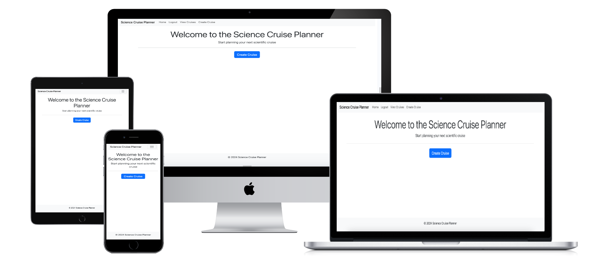

# Science Cruise Planner 

The application Science Cruise Planner is developed to facilitate the preperations for scientific cruises conduct with research vessels, in the terms of packing. When planning for a scientific cruise, the packing itinerary is crucial to ensure that sampling can go ahead as planned. 

[Live Site](https://cruise-preparation-92c5a099dd05.herokuapp.com/)

# Content 

## Project Goals 

### User Goals 
- Create a new cruise
- View cruise details
- Manage packing list 
- User authentication
- Mark item as packed

### Admin Goals 
- Admin Permissions 

### User Stories implemented 

- There is a form of interface to enter cruise name/number, start date and end date
- When data is entered, a new cruise is created
- It is possible to start adding packing itinerary
- There is a page view that displays cruise name, start date and end date
- The cruise is accessible through a unique URL or identifier
- There is an interface where items can be added to a specific cruise
- I can add new items to the packing list, specifying item name and quantity
- I can edit items from the packing list
- There is a user registration and login system
- Only users can create and modify cruises and packing lists
- I can access all cruises and items created
- I can delete a cruise from the system along with associated data
- I can access, create, manage and delete users from the system

### User Stories for further develoment 

- There is a checkbox next to the item which can be checked to mark it as packed
- Marking an item as packed updates its status in the database
- When viewing the cruise details, the items status is reflected in the pack list

