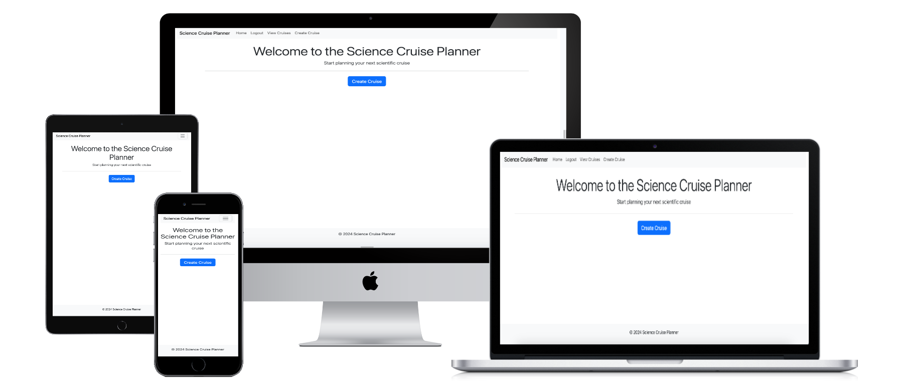
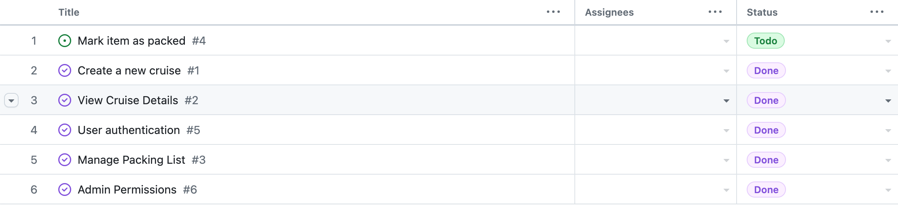
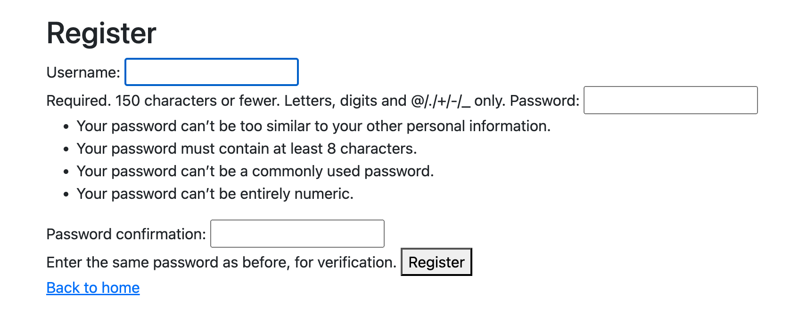
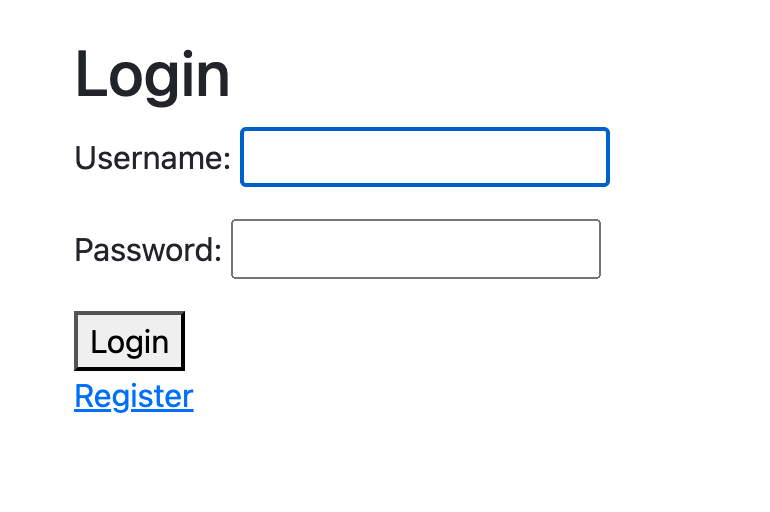
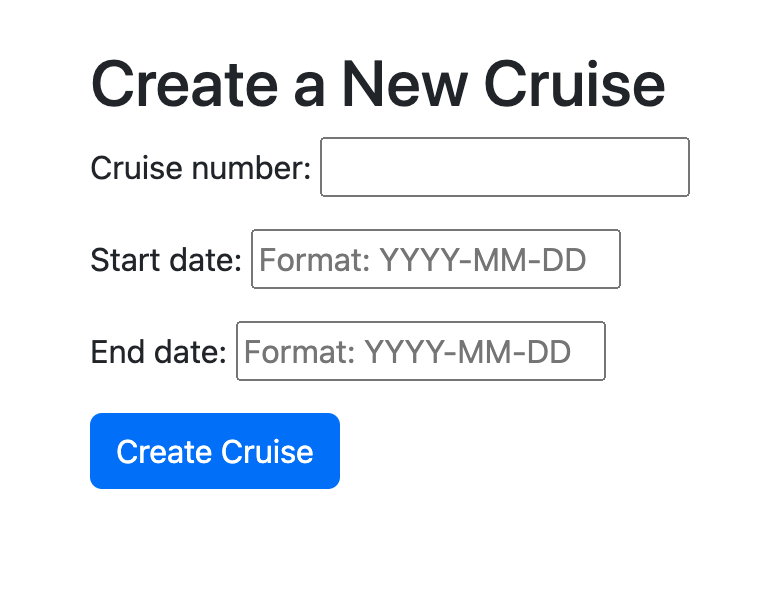
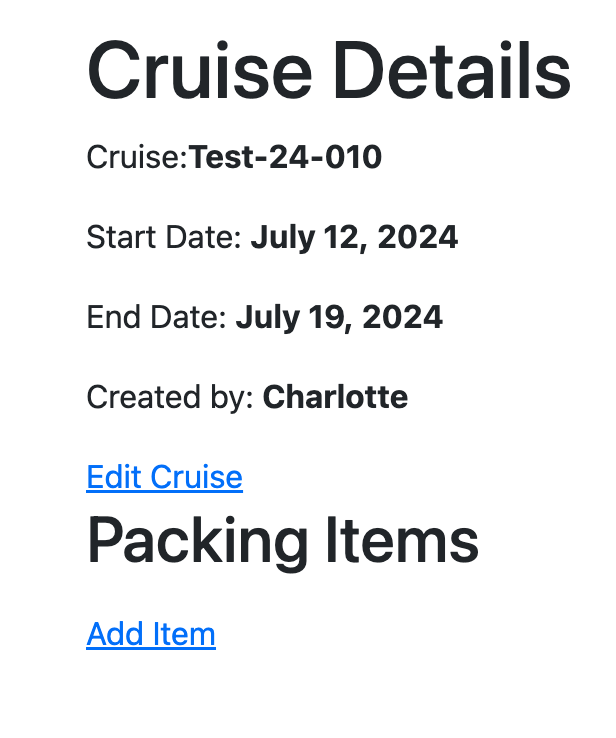
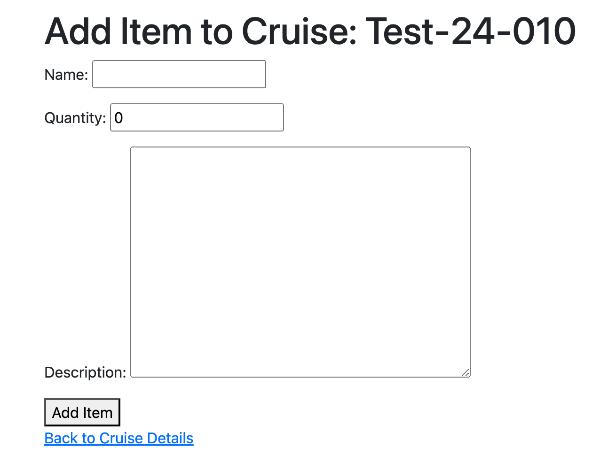
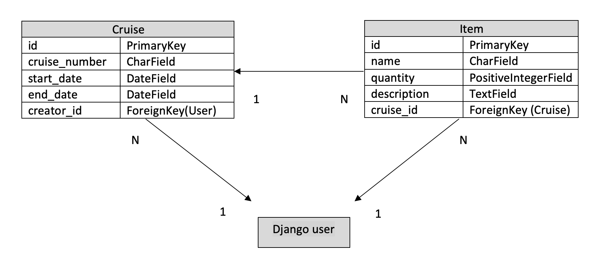

# Science Cruise Planner 

The application Science Cruise Planner is developed to facilitate the preparations for scientific cruises conducted with research vessels, in the terms of packing. When planning for a scientific cruise, the packing itinerary is crucial to ensure that sampling can go ahead as planned. 

[Live Site](https://cruise-preparation-92c5a099dd05.herokuapp.com/)



# Content 
- [Project Goals](#project-goals)
  - [User Goals](#user-goals)
  - [Admin Goals](#admin-goals)
  - [User Stories](#user-stories)
- [Features](#features)
  - [Navigation Bar](#navigation-bar)
  - [Register Page](#register-page)
  - [Login Page](#login-page)
  - [Create Cruise](#create-cruise)
  - [Cruise Details](#cruise-details)
  - [Add Item](#add-item)
- [Testing](#testing)
  - [Manual Testing](#manual-testing)
  - [Validation](#validation)
- [Run Locally](#run-locally)
- [Deployment](#deployment)
- [Technologies](#technologies)
- [Planning](#planning)
  - [Database schema](#database-schema)
- [Security](#security)
- [Further Development](#further-development)
- [Credits](#credits)

# Project Goals 

### User Goals 
- Create a new cruise
- View cruise details
- Manage packing list 
- User authentication
- Mark item as packed

### Admin Goals 
- Admin Permissions 

## User Stories

### User Stories implemented 

- There is a form of interface to enter cruise name/number, start date and end date
- When data is entered, a new cruise is created
- It is possible to start adding packing itinerary
- There is a page view that displays cruise name, start date and end date
- The cruise is accessible through a unique URL or identifier
- There is an interface where items can be added to a specific cruise
- I can add new items to the packing list, specifying item name and quantity
- I can edit items from the packing list
- There is a user registration and login system
- Only users can create and modify cruises and packing lists
- I can access all cruises and items created
- I can delete a cruise from the system along with associated data
- I can access, create, manage and delete users from the system

### User Stories for further development 

- There is a checkbox next to the item which can be checked to mark it as packed
- Marking an item as packed updates its status in the database
- When viewing the cruise details, the items status is reflected in the pack list

[Link to user stories](https://github.com/users/hebjornberg/projects/2/views/1)



# Features

## Navigation Bar 

### The navigation bar of the website is responsive and contain the following links: 

- Home page
- Login page
- Register page
- View Cruises page
- Create Cruise page

The navigation bar will contain different buttons depending on if the site user is logged in or not. 

<b>Before logging in:</b>


<b>When logged in as a user:</b>


The Science Cruise Planner logo also directs back to the Home page of the website. 

## Register Page 

### For a user to be able to create and plan a cruise, they will have to register as a user to the site. 



## Login Page 

### Before being able to create and plan a cruise, the user needs to login to the website. This in order to keep traceability of who created which cruise. 



## Create Cruise 

### The user is able to create cruises with: 

- Cruise Name
- Start date
- End date





## Cruise Details 

### Once a cruise is created, it will be directed to the Cruise Details section of the page. This will display: 

- Name of cruise
- Start date
- End date 
- Created by
- Packing Items 

In this view, it is also possible to start adding items to the packing list. 



## Add Item 

### Once a cruise is created, it is possible to start adding items to the packing list. The user that created the cruise additionally can edit the items added to the cruise. 

In the Add Items view, it is possible to state: 

- Name of item
- Quantity 
- Description 



# Testing

## Manual Testing 

The website has undergone manual testing. This has been documented in a separate testing file. 

Testing and validation: [Testing and validation](testing.md)

## Validation

Validation of code can be found in the testing-documentation. 

Testing and validation: [Testing and validation](testing.md)

# Run Locally 

To run this project locally, use the following steps: 

1. Clone the repository 

```bash
  git clone https://github.com/hebjornberg/cruise-preparation.git
```
 
2. Go to project directory 

```bash
  cd cruise-preparation
```

3. Install required dependencies 

```bash
  pip install -r requirements.txt
```

4. Set up environment variables. Create a env.py file in the root directory and add: 

DATABASE_URL=[your_database_url]

5. Apply migrations

```bash
  python manage.py migrate 
```

6. Run the server 

```bash
  python manage.py runserver
```

To run this application locally, it is necessary to set up a PostgreSQL to use as your database. 
Don't commit your env.py file to not share sensitive information regarding your database. 

# Deployment 

### The website has been deployed to Heroku. 

Steps to deploy to Heroku: 

1. Create a Heroku account
  - Go to [Heroku](https://www.heroku.com) and create an account
2. Create a new app 
  - Click "New" in the top right corner
  - Enter a unique app name
  - Choose your region 
  - Click "Create app" 
3. Add Configure Environment Variables 
  - DATABASE_URL: [This will be the url of your set up database]
  - DISABLE_COLLECTSTATIC: [1]
  - SECRET_KEY: [Your secret key]
4. Deploy the application 
  - Go to the "Deploy" tab 
  - Under "Deployment method", choose GitHub
  - Connect to your GitHub-account if prompted 
  - Connect your repository and click "Connect" 
  - Scroll to "Manual Deploy" 
  - Choose the main branch 
  - Click "Deploy Branch" 
5. Verify deployment 
  - Wait for the building process to complete
  - Click "View" to view the deployed application 

# Technologies

<b>- HTML</b>
   - The website was structured using HTML with template-inheritance. 

<b>- Bootstrap:</b>
    - The website was styled using the Bootstrap CSS framework. 

<b>- Python:</b>
    - The backend was built with Python using the Django framework. 

<b>- GitHub:</b>
    - The source code is hosted on GitHub, along with the planning of the application. 

<b>- Git:</b>
    - Throughout the creation of the website, the code was committed and pushed using Git. 

<b>Python Modules:</b>

- asgiref==3.8.1
- dj-database-url==0.5.0
- Django==4.2.13
- gunicorn==20.1.0
- psycopg2==2.9.9
- sqlparse==0.5.0

# Planning 

## Database schema



[PostgreSQL](https://dbs.ci-dbs.net/): Database management system provided by the Code Institute

# Security 

<b>Django Allauth:</b>
  - Handles authentication and authorization 
  - Handles registration, login, password management, social authentication. 
  - Ensures secure accounts processes 

<b>CSRF Protection:</b>
  - Prevents unauthorized actions from malicious websites
  - Django's built-in feature includes CSRF tokens with forms
  - Server-side verification tokens 

<b>Authenticated User Restrictions:</b>
  - Only registered users are able to create objects (cruises, packing items)
  - Helps with traceability in the planning process

# Further Development

During the development of this website, the aim was to reach the MVP, Minimal Viable Product, with the ability to create users, cruises and add packing items to the created cruises. 

Features that would be desirable for further development would be: 

- The ability to mark an item as packed, which would update its status in the database and also would be visible through the interface
- Function to see which user is currently logged in

# Credits

- Walkthrough "I Think Therefore I Blog" created by the Code Institute has been a crucial pillar in understanding the construction of a website with PostgreSQL and Django. 
- A special thanks to the tutoring support from the tutors at Code Institute when running into issues with the code. 
- A thank you to my mentor Sheryl Goldberg that helped me come up with the concept of the application 
- #community-sweden on Slack that always has a supportive word to give when you feel like you aren't getting anywhere 


