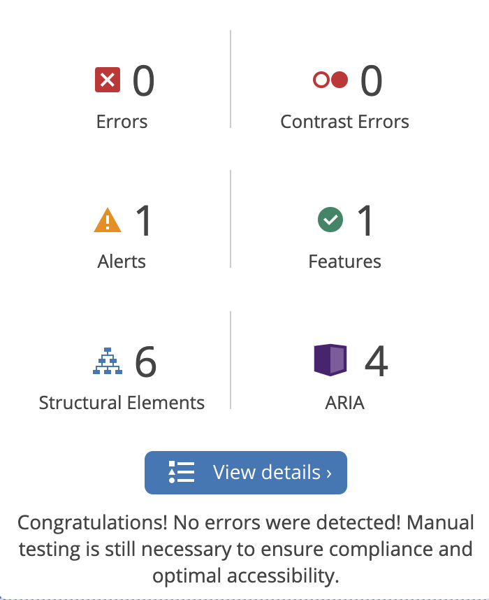

## Manual Testing of Application 

Navigation

 

<b>Navigation Bar</b>

Navigation was tested by clicking the links in the navigation bar, making sure it redirects you to the correct page. 

- Home - home.html
- Login - login.html
- Register - registration_form.html

- View Cruises - cruise_list.html
- Create Cruise - create_cruise.html

Register and Login

 

<b>Register and Login</b>

Testing was performed by registering a new user. The application warns that there is already an existing user when it was tried to input information already in the database. Once unique information was registered, a new user was created, with which you can log in. 

The registration and autherization of users is handled by the Django authentication system. 

- Register - registration_form.html
- Login - login.html

Create Cruise

 

<b>Create Cruise</b>

Once you have created a user, you can create a cruise. The autherization system is put in place to track who has created the cruise in question. When clicking the "Create Cruise"-button, you will either get directed to the create_cruise.html to create a cruise, or you will be asked to login, in case you haven't done this already. 

Add Item

 

<b>Add Item</b>

- Add Item - add_item.html
- Edit Item - edit_item.html

Once the cruise is created, you can start adding items to the packing items. You insert the name of the item, the quantity which you wish to bring, and an optional description. Any user that is logged in can add items to any cruise. But only the creator of a cruise can edit the items. This to keep traceability for changes in the planning stages of the cruise. 

View Cruises

 

<b>View Cruises</b>

- Cruise List - cruise_list.html
- Cruise Details - cruise_details.html

When clicking the View Cruises links, a list of created cruises appears. You can click on the individual cruises to view the Cruise Details of a specific cruise. 

Edit Cruise

 

<b>Edit Cruise</b>

- Edit Cruise - create_cruise.html

The user which created a cruise has the authority to edit the cruise information. 

Admin Rights

 

<b>Admin Rights</b>

- Testing was made through the Django interface. 
- As an admin, you have the ability to delete users and cruises with associated objects. 
- Tests were perfomed by deleting registered user and then trying to log in. 
- As the user has been deleted, it needed to be reregistered to be log into the application. 

## Validation 

# HTML and CSS

- The HTML and CSS was built using Bootstrap and Django syntax to inherit from a base.html-template. 

The code was run through the [Official W3C validator](https://validator.w3.org/). The errors occurring had nothing to do with the actual HTML-code, but with the syntax related to Django, and can therefore not be considered an error. 

# Python 

All code was run through the Code Institutes [Python Linter](https://pep8ci.herokuapp.com/#). 
The errors occurring was not related to functionality of the program. 

# Wave 

The website was put checked through wave, [Wave](https://wave.webaim.org/), with no errors occurring. 

## Responsiveness 

